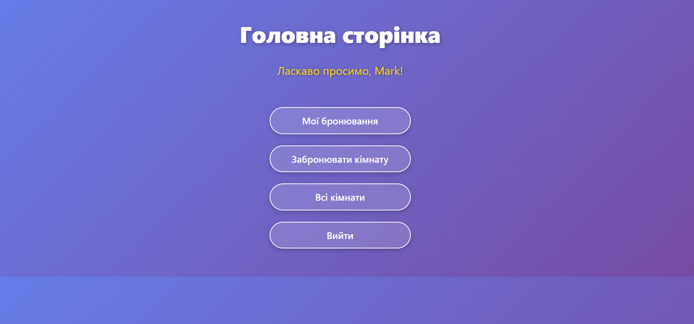
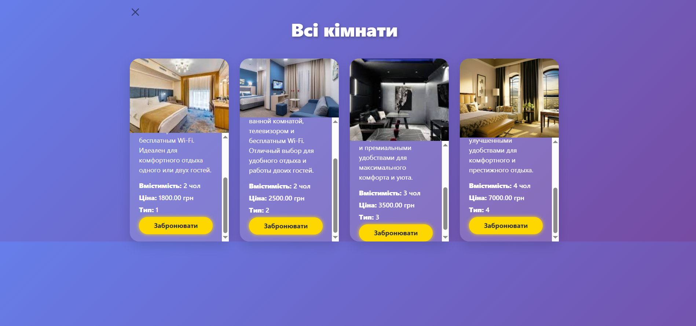
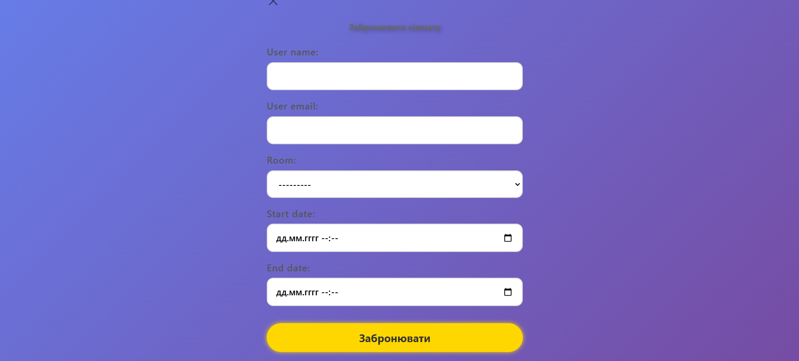
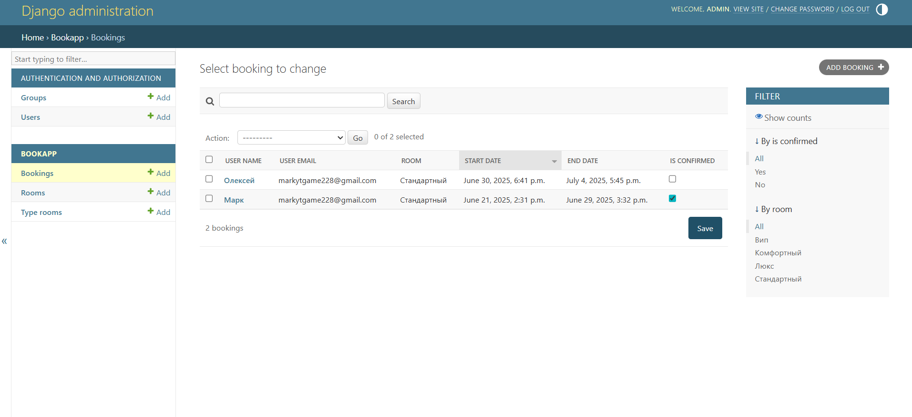
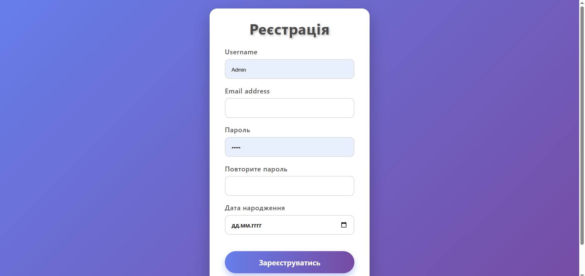
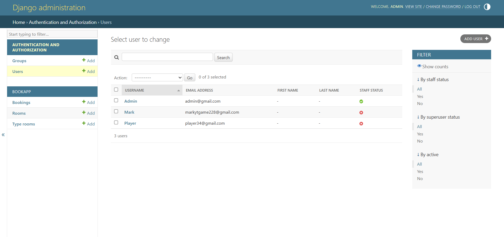

## 🔹 Проєкт "Бронювання Номерів" 🔹

## ❓ Питання, на які я відповім ❗️

# 🔹 Що це за проєкт та яка його мета?

🌐 Це сайт на тему **бронювання номерів в готелі**, який дозволяє користувачам 🧳 **шукати доступні номери** та **бронювати їх онлайн**.  

💡 Проєкт був створений в рамках навчальних курсів як практичне завдання.  

👨‍💻 Сайт розроблений мовою **Python** з використанням популярного веб-фреймворку **Django** 🐍.  

🎯 Мета проєкту — реалізувати повноцінний сервіс для готельного бронювання з простим інтерфейсом, зручною навігацією та базовою логікою на бекенді.

## 🔧 Який функціонал присутній у проєкті?

✅ **Пошук номерів** — можливість знайти доступні готельні номери за датами, ціною, типом.  
✅ **Бронювання онлайн** — користувач може обрати дату заїзду/виїзду, переглянути тарифи та оформити бронювання.  
✅ **Авторизація/Реєстрація** — для керування своїми бронюваннями, історією та профілем.  
✅ **Адмін‑панель** — можливість адміністратору додавати/редагувати номери, переглядати бронювання, налаштовувати тарифи.  
✅ **Реалізовано логіку бекенду** — обробка форм, перевірка доступності номерів, збереження даних у базі (SQLite/PostgreSQL), написано на Django.  
✅ **Мобільна адаптація** — сторінки добре відображаються на мобільних пристроях (за наявності responsive‑дизайну).  
✅ **Валідація даних** — форм введення (дата, контактні дані) перевіряються перед збереженням.  

---

## 🖼️ Кілька скріншотів з основними компонентами проєкту

📌 Нижче представлені ключові екрани вебсайту:

### 🏠 Головна сторінка
- Інформація про готель
- Кнопка для переходу до бронювання
- Простий та зручний інтерфейс

---

### 🔍 Пошук номерів
- Вибір дати заїзду/виїзду
- Пошук доступних номерів за параметрами

---

### 📝 Форма бронювання
- Введення даних клієнта
- Підтвердження замовлення

---

### 🔐 Авторизація та реєстрація
- Вхід до кабінету користувача
- Створення облікового запису

---

### ⚙️ Адмін‑панель (Django Admin)
- Керування номерами, бронюваннями, користувачами

)

---

## 🛠️ Додатково: Інструкції щодо запуску проєкту

Щоб успішно запустити цей проєкт, виконайте наступні кроки:

1. Склонуйте репозиторій:
git clone https://github.com/MolodoyProgramist/DjangoBook
2. Перейдіть до директорії проєкту:
cd DjangoBook
3. Запустіть сервер Django:
python manage.py runserver
Відкрийте браузер та перейдіть за адресою:
http://127.0.0.1:8000

